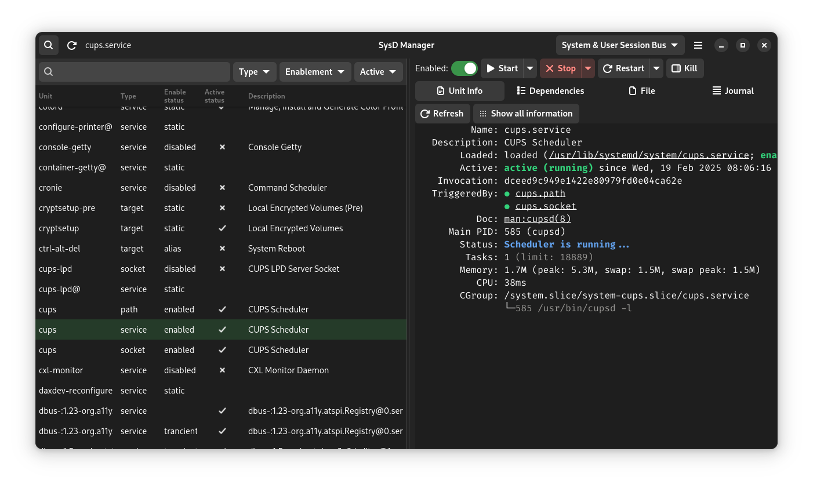
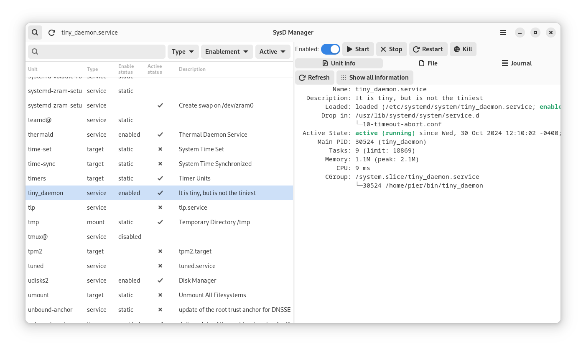
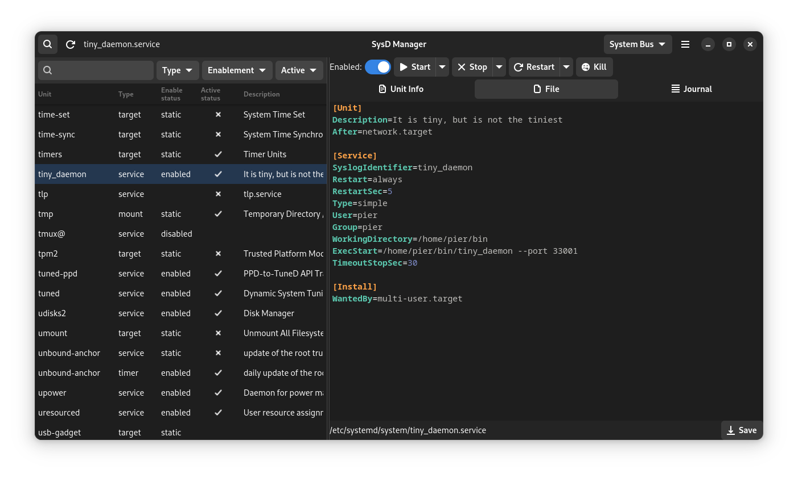
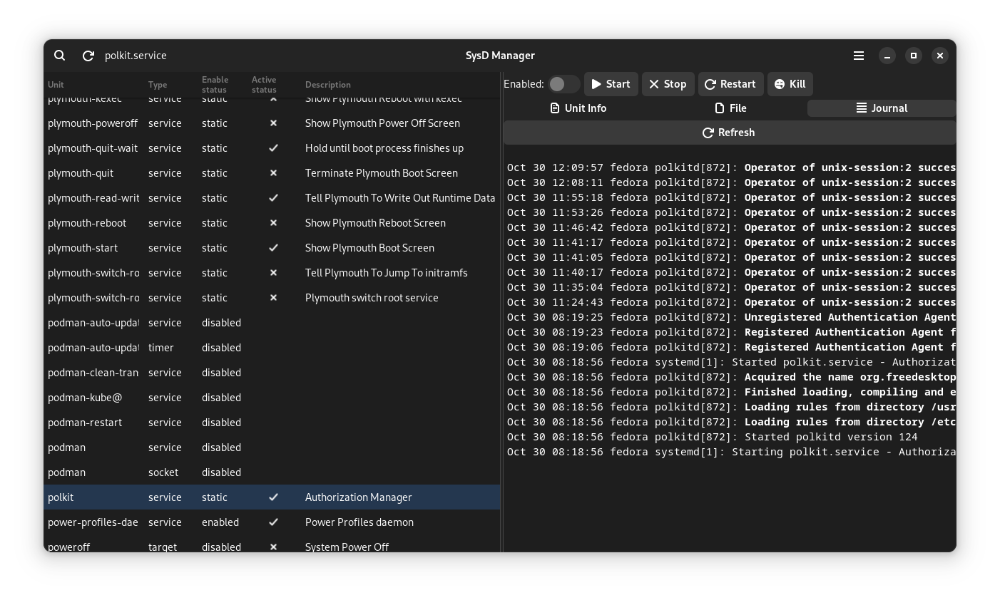

# SysD Manager

This application exists to easily allow user to manage their **systemd units** via a GUI. Not only are you able to make changes to the enablement and running status of each of the units, but you will also be able to view and modify their unit files and check the journal logs. 

## Disclaimer
This application is not intended to a profesional system administrator audience. 

If you consider yourself an administator, please refer to `systemctl` and `journalctl` documentation.

## Features

Here are __Sysd Manager__ main features :
* Unit file browser with serach and filtering
* Enable or disable a unit
* Activate or desactivate a unit
* View and modify unit file
* Unit file syntax highlighting 
* Journal file syntax highlighting 
* List of all running units, ordered by the time they took to initialize __systemd-analyze blame__
* Follow Dark and Light style switching
* Select a unit at program opening by passing a unit name as cli argument (see --help)


*__Note__ if you need a feature communicate with the author or contribute to the project. If you're stuck take a look at __systemctl__.*

## Requirement

Any Linux distribution that has adopted **systemd**.

## Screenshots










## Credit
This project is inspired by the work of Guillaume Gomez https://github.com/GuillaumeGomez/systemd-manager/

## Contributing
Contact me on my [GitHub](https://github.com/plrigaux/sysd-manager) if you want to contribute to this project.

## Project Roadmap
For now new features are planned to be added, such as:

* Non-blocking calls (in progress)
* Always administrator mode
* Disply unit dependancies
* Improve UX (continuously)

## Installation Instructions

### From your computer

* Download and install rust https://www.rust-lang.org/tools/install
* Install the build essentials
  * Install GTK 4 and the build essentials. [how-to](https://gtk-rs.org/gtk4-rs/stable/latest/book/installation_linux.html)
  * Install libadwaita [how-to](https://gtk-rs.org/gtk4-rs/stable/latest/book/libadwaita.html)
  * Install systemd development library **libsystemd-dev**
* Compile and install  ```cargo install sysd-manager```
* Run ```sysd-manager```

### Install on RHEL, Fedora, and CentOS based distributions 
__Important__ not up to date for a while, since Fedora rust librairies needed to build the project aren't updated.
You can install the application from COPR

#### Add the repo
First, you need to have dnf-plugins-core installed
```
sudo dnf install dnf-plugins-core
```

Then you can enable the repo with the following command
```
sudo dnf copr enable plrigaux/sysd-manager
```
#### Install with dnf

Then you can simply install sysd-manager with the following command
```
sudo dnf install sysd-manager
```
### Generate RPM for COPR

1 be in the mock group
Add your user name to the mock group
```
sudo usermod -a -G mock <my user name>
```

### Generate a RPM locally
You can generate your rpm locally with the help of the crate `cargo-generate-rpm`.

#### Install
```
cargo install cargo-generate-rpm
```

#### Usage
```
cargo build --release
strip -s target/release/sysd-manager
cargo generate-rpm
```

#### Install with dnf

Then you can install sysd-manager with the following command 

*Don't forget to ajust the the rpm file path*
```
sudo dnf localinstall target/generate-rpm/sysd-manager[version-release-arch].rpm
```

#### Setup 
```bash
cargo install cargo-generate-rpm
```
#### Usage
Run the following script. 

```bash
sh ./create_rpm
```

It will create a rpm file in the target/generate-rpm subdirectory.

### Flatpak

__SysD Manager__ can be build as a flatpak, but the flatpak version has limitations that can be overcome.

The limitation are :
* can't display journal
* Can't save the unit file

The application discloses how to overcome those limitations.

#### Install the builder

```
flatpak install org.flatpak.Builder
```

#### Build the flatpak
```
./goflatub build
```

#### Run the flatpak

To run the compiled flatpak execute the following command
```
./goflatub run
```

To access all program's functionnalities, you need the to have program __flatpak-spawn__ install on your system.


#### Possible issue

No remote refs found for ‘flathub’


```
flatpak remote-add --user --if-not-exists flathub https://flathub.org/repo/flathub.flatpakrepo
```

### APT
*Later waiting for a contributor or when I will reinstall e Debian like distro*


## Testing

If you want to test **Sysd Manager** without risking to shutdown impotant services, you can do it with **tiny_daemon**. **tiny_daemon** is a service provided with the project as a simple web server that you can safely play with.

To install **tiny_daemon**, in the project directory, just run this python script.


```
python install_tiny 
``` 

or if install_tiny is executable (i.e. ```chmod +x install_tiny```)

```
./install_tiny 
``` 

[](https://www.gnu.org/licenses/gpl-3.0)
