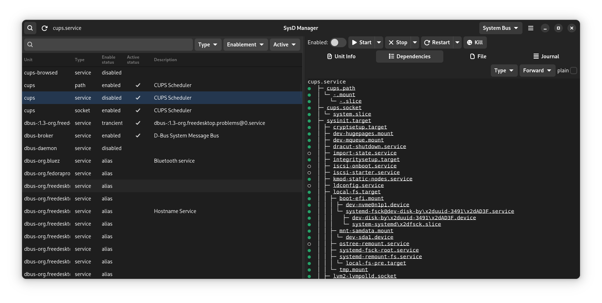

# SysD Manager

[](https://raw.githubusercontent.com/plrigaux/sysd-manager/refs/heads/main/LICENSE) [](https://github.com/sponsors/plrigaux)

## Description
This application exists to easily allow user to manage their **systemd units** via a GUI. Not only are you able to make changes to the enablement and running status of each of the units, but you will also be able to view and modify their unit files and check the journal logs. 

### Disclaimer
This application is not intended to professional system administrator audience. It has the purpose to expose unit management functionalities to less experienced users.

If you consider yourself an administrator, please refer to `systemctl` and `journalctl` documentation.

## Features

Here are __SysD Manager__ main features:
* [x] Unit file browser with search and filtering
* [x] Enable or disable a unit
* [ ] Enable or disable a unit in runtime
* [x] Activate or deactivate a unit
* [x] View and modify unit file
* [x] View and navigate unit's dependencies
* [x] Unit file syntax highlighting 
* [x] Journal file syntax highlighting 
* [x] List of all running units, ordered by the time they took to initialize __systemd-analyze blame__
* [x] Follow Dark and Light style switching
* [x] Select a unit at program opening by passing a unit name as cli argument (see --help)
* [ ] Clean unit like `systemctl clean`
* [ ] Freeze unit like `systemctl freeze`
* [ ] Thaw unit like `systemctl thaw`
* [ ] Multi languages
* [ ] Journal events updated automaticaly at realtime
* [x] Retreive list of boot ids 
* ...

*__Note__ if you need a feature communicate with the author or contribute to the project. If you're stuck take a look at __systemctl__.*

## Changelogs

All notable changes to this project are documented in [CHANGELOG](CHANGELOG.md).


## Requirement

Any Linux distribution that has adopted **systemd**.

## Screenshots





## Credit
This project is inspired by the work of Guillaume Gomez https://github.com/GuillaumeGomez/systemd-manager/

## Contributing
Contact me on my [GitHub](https://github.com/plrigaux/sysd-manager) if you want to contribute to this project.

## Project Roadmap
For now new features are planned to be added, such as:

* Non-blocking calls (in progress)
* Always administrator mode
* Improve UX (continuously)

## Installation

### Flathub

<a href="https://flathub.org/apps/io.github.plrigaux.sysd-manager"></a>

### Arch

A Arch package has been made for __SysD Manager__. It can be found at https://aur.archlinux.org/packages/sysd-manager
```
yay -S sysd-manager
```

### From your computer

* Download and install rust https://www.rust-lang.org/tools/install
* Install the build essentials
  * Install GTK 4 and the build essentials. [how-to](https://gtk-rs.org/gtk4-rs/stable/latest/book/installation_linux.html)
  * Install libadwaita [how-to](https://gtk-rs.org/gtk4-rs/stable/latest/book/libadwaita.html)
  * Install systemd development library **libsystemd-dev**
  * Install gtksourceview5 development library 
* Download sources ```git clone https://github.com/plrigaux/sysd-manager```
* Go to the newly created sysd-manager directory ```cd sysd-manager```
* Compile and install  ```sh install.sh```
* Run ```sysd-manager``` and VOILA!


_Note_ for a clean remove, execute the following ```sh uninstall.sh``


### APT
*Later waiting for a contributor or when I will reinstall a Debian like distro*


## Testing

If you want to test **SysD Manager** without risking to shutdown important services, you can do it with **tiny_daemon**. **tiny_daemon** is a service provided with the project as a simple web server that you can safely play with.

To install **tiny_daemon**, in the project directory, just run this python script.


```
cd packaging
python install_tiny 
``` 


