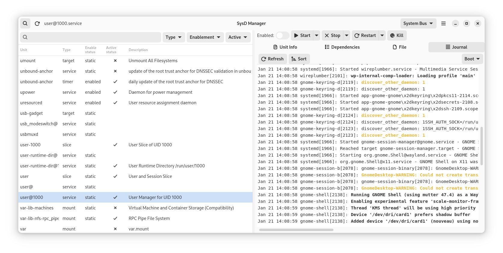

# Sysd Manager

This application exists to allow the user to manage their systemd services via a GUI. Not only are you able to make changes to the enablement and running status of each of the units, but you will also be able to view and modify their unit files, check the journal logs. 

## Feature

Here the features of Sysd Manager:
* Enable or disable a unit
* Actrivate or desactivate a unit
* View and modify unit file
* List of all running units, ordered by the time they took to initialize __systemd-analyze blame__

## Screenshots

## Credit
This project is inspired from the work of Guillaume Gomez https://github.com/GuillaumeGomez/systemd-manager/

## Contributing
Contact me on github if you whant to contribute to this project.

## Project Roadmap
For now new features are planned to be added, such as:
* File list brower
* Non blocking calls
* Syntax highlighting 
* Always administrator mode
* Improve UX

## Installation Instructions

For the moment:
* Dowload and install rust 
* Install needed libraries
* Compile the application
* Copy the binary in your PATH

### DNF
TPD

### APT
TPD

